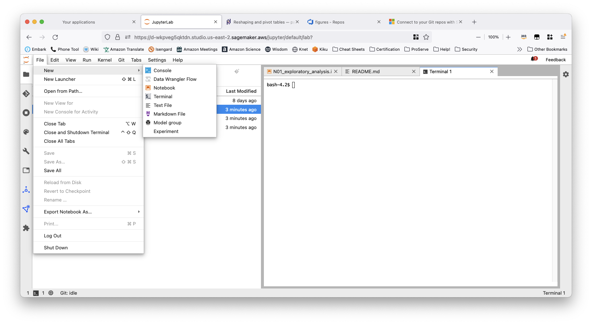
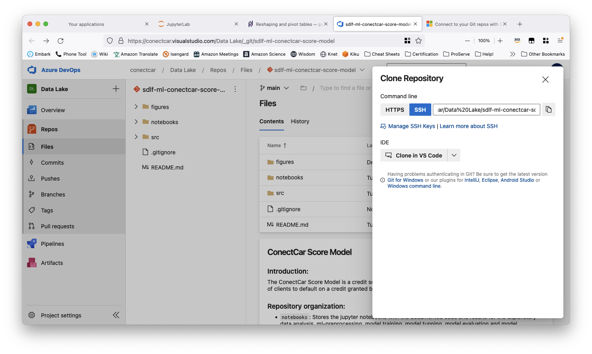
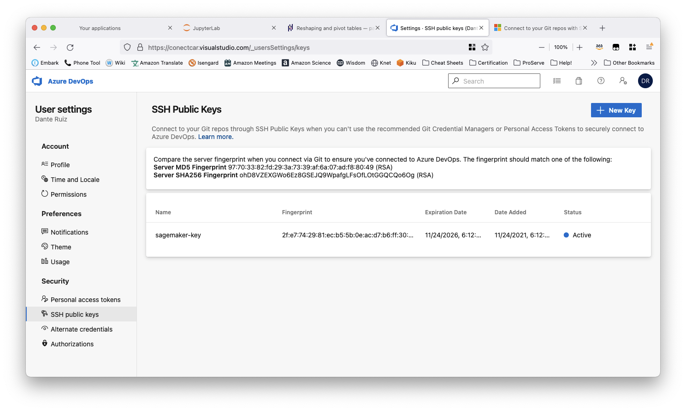
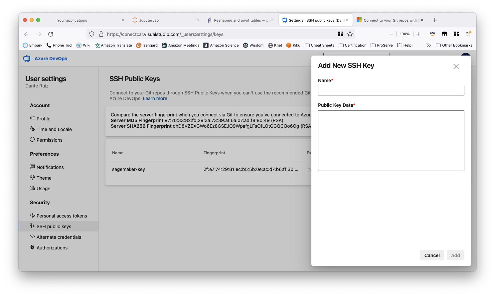
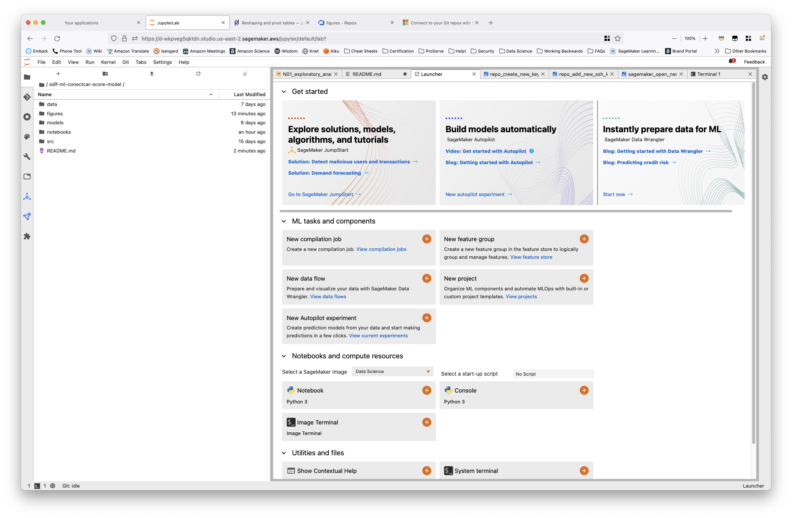

# ConectCar Score Model

## Introduction:

The ConectCar Score Model is a credit score model that uses machine learning to estimate the probability of clients to default on a credit granted by the company to complete a transaction.

## Repository organization:

* `notebooks`: Stores the jupyter notebooks with the documented code and results for the exploratory data analysis, ml-preprocessing, model training, model tunning, model evaluation and model inferencing.
* `models`: Directory that stores temporaly the best models and grid search results.
* `src`: Stores SQL code for Redshift views.
* `data`: Stores any transitory data.
* `figures`: Images for the reports.

## For more permanent storage:

* The modelling notebook stores in S3 the data used to run the models, the best models and the parameter random search results.

* The file storage is located in https://s3.console.aws.amazon.com/s3/buckets/cntcar-dlk-us-east-2-135212681908-artifacts?region=us-east-2&tab=objects and is organized as:

    - `best-models/`: Stores the best models
    - `model-data/`: Stores the data used to train, validated and test models.
    - `model-output/`: **Stores the ConectCar customers scores to default on a granted loan after 15 days.**
    - `model-preprocessor/`: Stores the preprocessing function to build the design matrix.
    - `random-search-results/`: Stores the random search results.

## Instructions:

### Open Sagemaker Studio

* To use Sagamkaer you have to open `us-east-2-datalake-sandbox` AWS account.

### Clone repository to Sagemaker accounnt

* Open your Sagemaker Studio account and configure a public and private SSH key. (See [documentation](https://docs.microsoft.com/en-us/azure/devops/repos/git/use-ssh-keys-to-authenticate?view=azure-devops))

    - In Sagemaker studio open a new bash terminal, click on `File` tab, then click `New` then `Terminal` .

        

    - Check if you already have a `~/.ssh` folder and if it contains any SSH key. If you do have it, you can use that key, and jump to the copy SSH public key to Azure Devops step. If you do not have the directory you have to create it running the following line.
    
        + Create directory: `mkdir ~/.ssh`
        
        + Move to this directory: `cd ~/.ssh`
        
        + Create the SSH key and follow the prompt instructions: `ssh-keygen -C "user@conectcar.com"`
        
        + The last step created a private key ( `id_rsa`) and the public key ( `id_rsa.pub` )
        
* Link your SSH public key to the Azure DevOps Services/TFS.

    - In the repository click on the button clone.

    - Then click SSH button and click the `Manage SSH Keys` link.
    
        
    
    - In the SSH public keys page click on the button `New Key`:

        
      
        + Give a name to identify your public key in the repository such as `sagemaker-user-ssh-public-key`.
               
        + Go to the Sagemaker terminal and open the `id_rsa.pub` file using `cat id_rsa.pub` 
        
        + Copy the content and paste it in Azure Devops `public key data`.
        
        + Click add button.

        

* In the repository click on the button clone and in the command line choose SSH.

    - Copy the output link: `conectcar@vs-ssh.visualstudio.com:v3/conectcar/Data%20Lake/sdlf-ml-conectcar-score-model`
    
* Go to the terminal and move to the root directory and clone the repository there:

    - Move to root directory: `cd ~`
    
    - Clone the direcotry: `git clone conectcar@vs-ssh.visualstudio.com:v3/conectcar/Data%20Lake/sdlf-ml-conectcar-score-model`
    
    - When finished you will see in the root directory under the name `sdlf-ml-conectcar-score-model`

* If successful, you are going to see the repository in Jupyter Lab environment.

     

### Create materialized views in Redshift

* The data that supports the ML model is in RedShift and it consists in three views.

    - `v01_customer_last_transaction.sql`: Data from the last customer transaction in ConectCar.
    
    - `v01_customer_financial_history.sql`: Data that contains customer financial history in ConectCar.

    - `v02_customer_union.sql`: Joins to views, and this is the one that feeds the model.

* To create, reproduce, modify or replace the views the code of these views can be accessed in the `src/sql` directory.

### Update materialized views

* Once the views are created, if we want to update the views to consider the latest information we can run the following commands.

    - `REFRESH MATERIALIZED VIEW cntcar_ds_work.v01_customer_last_transaction;`

    - `REFRESH MATERIALIZED VIEW cntcar_ds_work.v01_customer_financial_history;`

    - `REFRESH MATERIALIZED VIEW cntcar_ds_work.v02_customer_union;`

### Create a secret with the Redshift Credentials

    - Create in AWS secrets manager the user and password to access the Redshift database.
    
    - Copy the secret name such as `dante_ruiz/redshift/user`, we will need it when in the Jupyter notebook we need to connect to the AWS Redshift cluster.

### Run Python Jupyter Notebooks

* All reproducible code is stored in the `notebooks` directory. The data is pulled from redshift.

    - `N00_data_quality_check.ipynb`: Code used to diagnose the quality of data and have a look and feel at it.
    
    - `N01_exploratory_analysis.ipynb`: Code used to explore the dataset, to understand relationships, and inform the feature engineering.
    
    - `N02_preprocessing.ipynb`: Code used to test preprocessing functions from `transformers.py`
    
    - `N03_model_scoring.ipynb`: Code to train, validate, test, calculate scores and model explainability.
    
### Update model using new information

* To update the model with new information we need to:

    - Make changes to the redshift views or just refresh the views so they can append the new information.

        + `REFRESH MATERIALIZED VIEW cntcar_ds_work.v01_customer_last_transaction;`

        + `REFRESH MATERIALIZED VIEW cntcar_ds_work.v01_customer_financial_history;`

        + `REFRESH MATERIALIZED VIEW cntcar_ds_work.v02_customer_union;`
    
    - If a new variable is going to be added to the model please ensure to:
    
        + Perform any exploratory analysis to check for null values, check categories, relationships with target variable and correlations with other predictors. You can do this using by updating the exploratory data analysis notebook `N01_exploratory_analysis.ipynb`. When you finish understanding the new input, you can proceed to include it in the model.
        
        + To include a new variable, the model has to be updated in `N03_model_scoring.ipynb`. If special preprocessing is required to be done inside the pipeline, such as special imputations, category agregations, cleaning text, etc, a python function needs to be written in `transformers.py` script. You can make sure the function is working before adding it to the model in the `N02_preprocessing.ipynb`. You can base your test by looking to the others in the notebook. 
        
        + When you are ready to add the new variable to the model in `N03_model_scoring.ipynb`, you need to update the following sections.
        
            - Loading data: You need to include the new variable in the pandas dataframe `df_model_data`.
            
            - Preprocessing: 1) add a new preprocessing pipeline, either you include the variable in no transformation variables list or you add all the necessary steps to transform the data such as normalization, imputation, a user defined function or one hot encoding. 2) Include the new variable pipeline inside the `preprocessor` object so it can append the new variable transformation in the final model matrix. 3) To check if we were successful, the preprocessor diagram should include the new variable pipeline as the rest of the variables. 4) Extract the name of the new variable or variables in the `get_feature_names`, here order matters and should be in the same order as in the preprocessor object. 
            
            - Base model: To check if we were successful, we execute the base model, and we ensure there are no errors. If we see an error we stop and debug, using the APIs documentation. If successful, we can proceed to the model tuning.
            
            - Tuning: We rerun all the models bearing in mind that this process takes a while. Based on overfit and underfit diagnostics in the random search validation, we decide if it is necessary to update the hyperparameters.
            
            - Calculate scores for customers: Check which model yield the best predictions, make any changes necessary, and run this section to upload the customer scores table to RedShift. Scores are loaded in the `cntcar_ds_work` schema as a table with the name `v03_customer_scores`.

## Customer scores

* The modelling notebook `N03_model_scoring.ipynb` uses the best model and uploads to Amazon RedShift the scores for all customers that requested a loan in the period of study.

* The table is uploaded to the `cntcar_ds_work` schema with the name `v03_customer_scores`.

## Python version

* The python version used in this project is `3.*`

## Packages and versions

* The project uses a Data Science kernel image that is based in a anaconda distribution.

* The necessary packages and versions used for this project are:

    - seaborn==0.11.2
    - plotnine==0.8.0
    - yellowbrick
    - scikit-learn==1.0.1
    - xgboost==1.5.0
    - lightgbm==3.3.1
    - catboost==1.0.3
    - pytest-cov
    - pytest-filter-subpackage
    - apt-get update && apt-get install -y build-essential
    - shap
    - psycopg2-binary sqlalchemy-redshift sqlalchemy
    - plotnine==0.8.0
    - pandas_bokeh 

## Documentation of packages:

* Data preprocessing:
    - [Numpy](https://numpy.org/doc/stable/#)
    - [Pandas](https://pandas.pydata.org/docs/)

* Data visualization:
    - [Matplotlib](https://matplotlib.org/)
    - [seaborn](https://seaborn.pydata.org/)
    - [plotnine](https://plotnine.readthedocs.io/en/stable/)
    - [Pandas-Bokeh](https://github.com/PatrikHlobil/Pandas-Bokeh)

* Machine learning:
    - [scikit-learn](https://scikit-learn.org/stable/)
    
* Interpretability:
    - [shap](https://github.com/slundberg/shap)
    
* AWS Python SDK
    - [boto3](https://boto3.amazonaws.com/v1/documentation/api/latest/index.html)